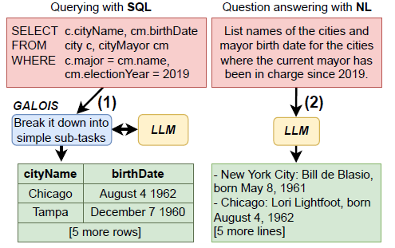

# Galois: Querying Large Language Models with SQL
[(Paper)](https://arxiv.org/abs/2304.00472)



In many use-cases, information is stored in text but not available in structured data. However, extracting data from natural
language (NL) text to precisely fit a schema, and thus enable
querying, is a challenging task. With the rise of pre-trained Large
Language Models (LLMs), there is now an effective solution to
store and use information extracted from massive corpora of
text documents. Thus, we envision the use of SQL queries to
cover a broad range of data that is not captured by traditional
databases (DBs) by tapping the information in LLMs. This ability
would enable the hybrid querying of both LLMs and DBs with
the SQL interface, which is more expressive and precise than NL
prompts. To show the potential of this vision, we present one
possible direction to ground it with a traditional DB architecture using physical operators for querying the underlying LLM.
One promising idea is to execute some operators of the query
plan with prompts that retrieve data from the LLM. For a large
class of SQL queries, querying LLMs returns well structured relations, with encouraging qualitative results. We pinpoint several
research challenges that must be addressed to build a DBMS that
jointly exploits LLMs and DBs. While some challenges call for
new contributions from the NLP field, others offer novel research
avenues for the DB community.

## Installation
### Clone Repo
```bash
git clone https://gitlab.eurecom.fr/saeedm1/galois.git
cd galois
```

### Create virtual env and install reqs

```bash
conda env create -f environment.yml
conda activate galois
unzip data/fixed_spider.zip -d data/spider_files
apt install sqlite3
```

## Experiments
The following steps were needed to run the experiments:

1. Data Preparation found in `src/data-prep/`. This includes:
    - [Choosing the queries used for the exps.](src/data-prep/data-prep.ipynb)
    - [Mapping DuckDB operations to Natural Language queries.](data/question_maps.json)
    - [Manually parsing DuckDB query plans for join operations.](src/galois-run/Galois_OpenAI_run.ipynb)

2. Running Galois for both OpenAI and HuggingFace models found in [`src/galois-run/`](src/galois-run/).
__Note__: You will have to insert your openai key in `.env`. Table 2 values are provided only for OpenAI models. Table 1 values are provided for OpenAI and HuggingFace Models.

3. Manual evaluation for the results are found in [`data/results/`](data/results/).

4. Evaluation of the data found in [`src/parse-results/`](src/src\parse-results\results.ipynbparse-results/results.ipynb).
